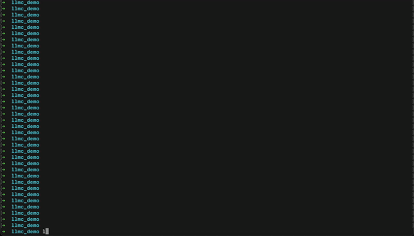

llmc
====




llmc is a local inference command-line tool powered by llama.cpp that transforms natural language descriptions into executable shell commands.

* Natural Language Command Generation: Simply describe the command you need in plain language, and llmc will generate the appropriate shell command for you.
* Customizable Models: Choose from a variety of preconfigured models or provide your own for custom workflows.
* Multiple Modes:
    * loop mode: Continues to choose and execute commands.
    * exit mode: Executes a single command and exits.
* Command Explanation: Optionally provides an explanation of the generated command.
* Tracing: Enable model tracing to debug and track the execution process.


Install
-------

To build llmc from source, use the following command:

    make llmc

Usage
-----

To use llmc, provide a natural language description:

    llmc "your prompt"

You can run `llmc` without arguments to explore options:

```bash
--------------------------------- llmc params ----------------------------------
-h,    --help, --usage                  Print llmc usage
--setup                                 Set up your llmc model: choose or customize
--show-args                             Show arguments you saved
--no-explanation                        Disable command explanation
--mode {loop,exit}                      Select the mode of operation.
                                                - loop: Continues to choose and execute commands indefinitely.
                                                - exit: Executes a single command and then stops the program.
--model-help, --model-usage             Print llmc default model arguments
--trace                                 Enable tracing for the execution of the default model
```

Supported Models
----------------

llmc comes with support for the [following preconfigured models](https://huggingface.co/MingfeiGuo/llmc/tree/main):

* Llama-3.2-3B-Instruct-Q8_0
* Llama-3.2-1B-Instruct-Q8_0
* qwen2.5-7b-instruct-q8_0
* codellama-13b.Q8_0

You can also provide your own model with custom system prompts.


Troubleshooting
----------------

```bash
ggml_metal_graph_compute: command buffer 1 failed with status 5
error: Insufficient Memory (00000008:kIOGPUCommandBufferCallbackErrorOutOfMemory)
```

This typically occurs when the system does not have enough memory to load and run the selected model. To resolve, consider using a smaller model.


Community & Contact
----------------

Connect to discuss llmc, share feedback, and get support from other users:

[Join the llmc Discord group](https://discord.gg/zG4x6NuT5q)

For any questions or inquiries, feel free to reach out via email:

[Email me](mailto:mingfeiguoo@gmail.com)
